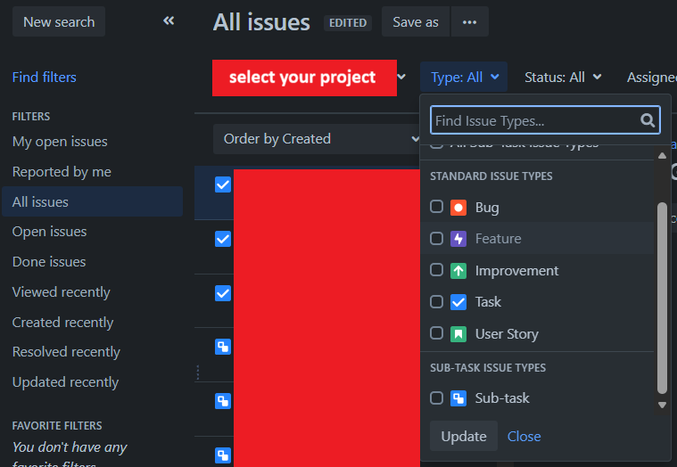
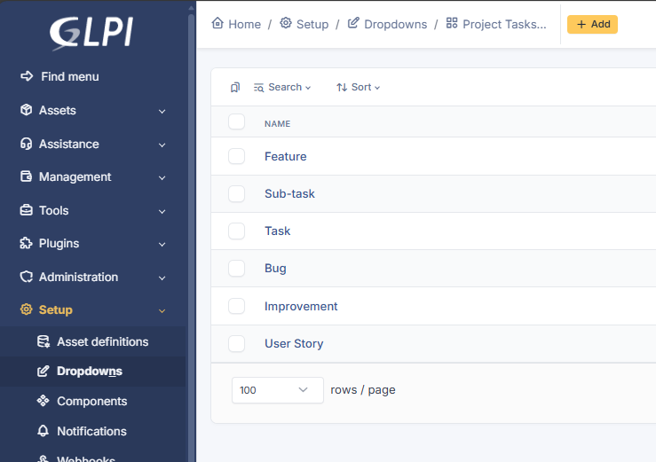
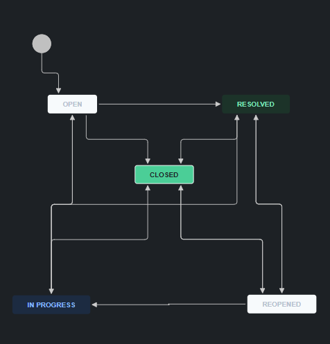
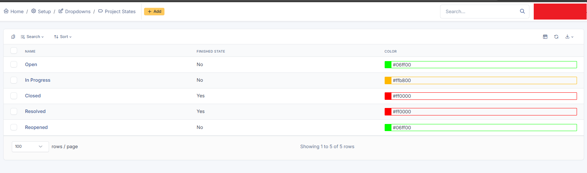

# User Guide: Jira to GLPI Migration Script (API Mode)

This script automates the migration of Jira Issues (Tickets) to GLPI Projects (Tickets) via the REST API. It uses the Jira API to fetch issues and the GLPI API to create tickets, ensuring a robust migration even for large datasets (thousands or millions of tickets) through batch processing and resume capability.

## 1. Directory Structure

Inside the `02_jira_to_glpi_migration` folder, you will find:
- `config.py`: Configuration file (Important).
- `jira_to_glpi.py`: Main script to execute the migration.
- `jira_client.py`: Jira API client library with pagination support.
- `glpi_api.py`: GLPI API client library (enhanced for Tickets).
- `requirements.txt`: Required Python packages.
- `migration_state.json`: Auto-generated file to track progress (Resume capability).

## 2. Prerequisites

### Install Python
Ensure Python 3.x is installed on your system.
```bash
python --version
```

If not install, Install Python Silently (Without GUI)
```bash
python-installer.exe /quiet InstallAllUsers=1 PrependPath=1 Include_test=0
```

### Install Dependencies
Open a Command Prompt or Terminal in the project folder and run:
```bash
pip install -r requirements.txt
```

### GLPI Configuration (API & Tokens)
Refer to USER_GUIDE.md in 01_confluence_to_glpi_migration folder for detailed instructions.

### Jira Configuration (PAT)
You need a **Personal Access Token (PAT)** from your Jira Server.
1.  Log in to Jira.
2.  Click on your Profile Picture (top right) > **Profile**.
3.  Click **Personal Access Tokens** in the left menu.
4.  Click **Create token**.
5.  Give it a name and set Expiry date.
6.  **Copy the token** and save in safe place since you won't be able to see it again.

### Jira Settings
*   **JIRA_URL**: Your Jira URL in browser, including  '/jira' at the end.
*   **JIRA_PAT**: Paste your Personal Access Token here.
*   **JIRA_PROJECT_KEY**: The Key of the Project you want to migrate (look at the url in browser, it is the part after '/projects/').

## 3. Configuration
Open `config_example.py` in a text editor and update the variables with the values you obtained above then rename to `config.py`:

### Migration Settings
*   **BATCH_SIZE**: Default is `50`. Adjust if you want to fetch more/less tickets per request.
*   **STATE_FILE**: Default is "migration_state.json". This file is used to resume if the script is interrupted (lost internet, server down, etc). To start from the beginning, delete this file.

### Dynamic Type Mapping (Project Tasks)

The script also maps Jira **Issue Types** to GLPI **Project Task Types**.



1.  Log in to GLPI.
2.  Go to **Setup** > **Dropdowns** > **Assistance** > **Project Tasks Types**.
3.  Add/edit/delete types, ensuring all Jira issue types are mapped, no missing, no redundant.



### Dynamic Status Mapping (Project Tasks)

#### Identify Jira Statuses
Check your Jira project for all possible statuses, for example



#### Configure GLPI Project States
The script will look for a **GLPI Project Task > State** with the **exact same name** as the Jira Status.

1.  Log in to GLPI.
2.  Go to **Tools** > **Projects** > select your project > **Project** tab.
3.  In the **States** section, click on **+** or **i** icon to add/edit/delete states, ensuring all Jira statuses are mapped, no missing, no redundant.



## 4. Running the Migration

Run the following command:
```bash
python jira_to_glpi.py
```

## 5. Features & Behavior

### Resume Capability (State Saving)
*   The script creates a file named `migration_state.json`.
*   It saves the progress (how many tickets processed) after every batch.
*   **If the script stops** (internet lost, computer restart, Ctrl+C), just run `python jira_to_glpi.py` again. It will automatically **resume** from where it left off.
*   To restart from the beginning, delete `migration_state.json`.

### Attachments
*   The script automatically downloads attachments from Jira and uploads them to GLPI.
*   Links to these files are embedded in the Ticket Description.

### Comments
*   Jira Comments are migrated as **Followups** in GLPI.
*   The original author and timestamp are preserved in the text body (e.g., `[2023-01-01] John Doe wrote:`).

## 6. Verification
*   Check the console output for "Success! Ticket ID: ...".
*   Check your GLPI Project/Ticket list to see the incoming data.

## 7. Limitations
*   **Ticket ID**: GLPI generates new IDs. The original Jira Key is preserved in the *Title* and *Description* for reference.
*   **Users**: The script uses a single API User to create tickets. The original reporter's name is added to the Description text, but the GLPI "Requester" field will be the API User (unless mapped explicitly).
