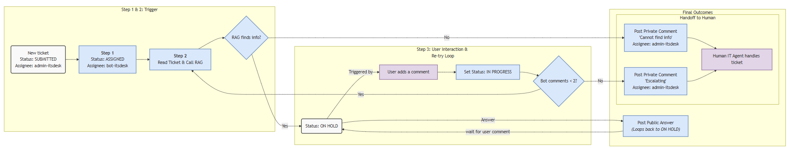

# IT Agent System

## Project Objective
1. Migrate data from Atlassian to GLPI
Reason: GLPI has a free community version on premise, no more license costs for Atlassian Confluence and Jira, but no migration tool.
2. The final goal is to create an intelligent agent system that automatically triggers when an IT ticket is created or updated in GLPI.

The agent performs the following actions:
1.  **Analyze**: Reads the content of the GLPI ticket.
2.  **Retrieve**: Searches for relevant knowledge stored in the GLPI Knowledge Base.
3.  **Respond (Automated/AI)**:
    *   If relevant information is found with **high confidence**, the agent posts a comment on the GLPI ticket to answer the user directly.
4.  **Escalate (Human-in-the-loop)**:
    *   If no relevant information is found, OR
    *   If the confidence score is low, OR
    *   If the user remains unsatisfied after 3 automated attempts:
    *   The system assigns the ticket to a human IT agent, providing AI-generated suggestions to assist them.

## Roadmap & Milestones

1.  **Data Migration (from Confluence to GLPI > Tools > Knowledge Base)**
    *   See [User Guide](01_confluence_to_glpi_migration/USER_GUIDE.md)
    *   *Status: Done*

2.  **Data Migration (from Project Jira to GLPI > Tools > Projects)**
    *   See [User Guide](02_project_jira_to_glpi_project_tasks_migration/USER_GUIDE.md)
    *   *Status: In Progress*

3.  **Data Migration (from Support Jira to GLPI > Assistance)**
    *   *Status: Pending*

4.  **RAG & Agent Orchestration**
    *   Implement Retrieval-Augmented Generation (RAG).
    *   Build agent orchestration connected to an AI server running **Ollama** via API.
    *   *Status: Not Started*

5.  **Improvements & Features**
    *   **Auto-Update Index**: Automatically update the index when the Knowledge Base changes.
    *   **Agent Management UI**: Create a user interface to manage agents.
    *   **Human Feedback**: Enable feedback loops (RLHF) to improve agent performance.
    *   *Status: Not Started*
