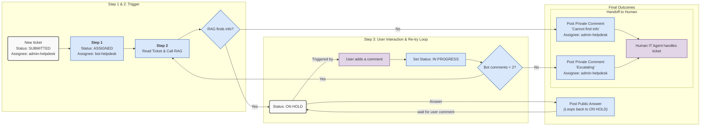

# IT Agent System

**Business Impact:** Successfully automated the migration from Atlassian to GLPI free on-premises, saving a large amount of money in Atlassian licensing fees, and reduced routine IT support tickets by 50%, plus data sovereignty on-premises.

**Tech Stack:** Python | LangGraph | n8n | DeepSeek | RAG | GLPI | Atlassian

## Project Objective

1. Migrate data from Atlassian to GLPI
**Reason:** GLPI has a free community version on-premises - no more license costs for Atlassian Confluence and Jira, but no built-in migration tool.
2. The final goal is to create an intelligent agent system that automatically triggers when an IT ticket is created or updated in GLPI.

The agent performs the following actions:

1. **Analyse**: Reads the content of the GLPI ticket.
2. **Retrieve**: Searches for relevant knowledge stored in the GLPI Knowledge Base.
3. **Respond (Automated/AI)**:
    * If relevant information is found with **high confidence**, the agent posts a comment on the GLPI ticket to answer the user directly.
4. **Escalate (Human-in-the-loop)**:
    * If no relevant information is found, OR
    * If the confidence score is low, OR
    * If the user remains unsatisfied after 3 automated attempts:
    * The system assigns the ticket to a human IT agent, providing AI-generated suggestions to assist them.


```mermaid
graph LR
    classDef jiraAction fill:#f9f9f9,stroke:#333,stroke-width:2px
    classDef botAction fill:#dae8fc,stroke:#6c8ebf,stroke-width:2px
    classDef humanAction fill:#e1d5e7,stroke:#9673a6,stroke-width:2px

    subgraph "Step 1 & 2: Trigger"
        direction TB
        A(New ticket<br>Status: SUBMITTED<br>Assignee: admin-helpdesk)
        B["<b>Step 1</b><br>Status: ASSIGNED<br>Assignee: bot-helpdesk"]
        C["<b>Step 2</b><br>Read Ticket & Call RAG"]
        D{RAG finds info?}
    end

    subgraph "Step 3: User Interaction & Re-try Loop"
        direction TB
        G(Status: ON HOLD)
        H["User adds a comment"]
        I["Set Status: IN PROGRESS"]
        J{Bot comments < 2?}
    end

    subgraph "Final Outcomes"
        direction TB
        M["Post Public Answer<br><i>(Loops back to ON HOLD)</i>"]
        
        subgraph "Handoff to Human"
            F["Post Private Comment<br>'Cannot find info'<br>Assignee: admin-helpdesk"]
            O["Post Private Comment<br>'Escalating'<br>Assignee: admin-helpdesk"]
            P["Human IT Agent handles ticket"]
        end
    end
    
    %% --- Define Flows between Stages ---
    A --> B --> C --> D;
    
    %% Triage Outcomes
    D -- Yes --> G;
    D -- No --> F;
    
    %% Interaction Loop
    G -- Answer --> M;
    G -- Triggered by --> H --> I --> J;
    J -- Yes --> C;
        
    %% Escalation
    J -- No --> O;
    
    %% Loop & Handoffs
    M -- wait for user comment --> G;
    F --> P;
    O --> P;

    %% --- Apply Styling ---
    class A,G jiraAction
    class B,C,D,I,J,M,F,O botAction
    class H,P humanAction
```

## Project Structure

```text
IT-agent/
├── common/                    # Shared library (imported by all migrations)
│   ├── import_ldap_playwright.py  # LDAP user import automation
│   ├── clients/              # API clients (GLPI, Jira)
│   ├── config/               # Configuration loader with inheritance
│   ├── utils/                # Utilities (dates, state management)
│   ├── tracking/             # User tracking
│   └── logging/              # Structured logging
│
├── 01_confluence_to_glpi_migration/           # Migration 1: Knowledge Base
├── 02_project_jira_to_glpi_project_tasks_migration/  # Migration 2: Project tickets
└── 03_support_jira_to_glpi_assistance_tickets_migration/  # Migration 3: Assistance tickets
```

**Note:** Migrations are numbered for organisation. Each migration is independent and can be run in any order based on your needs.

## Roadmap & Milestones

1. **Data Migration (from Confluence to GLPI > Tools > Knowledge Base)**
    * See [User Guide](01_confluence_to_glpi_migration/USER_GUIDE.md)
    * *Status: Done*

2. **Data Migration (from Project Jira to GLPI > Tools > Projects)**
    * See [User Guide](02_project_jira_to_glpi_project_tasks_migration/USER_GUIDE.md)
    * *Status: Done*

3. **Data Migration (from Support Jira to GLPI > Assistance)**
    * See [User Guide](03_support_jira_to_glpi_assistance_tickets_migration/USER_GUIDE.md)
    * *Status: Done*

4. **RAG & Agent Orchestration**
    * Implement Retrieval-Augmented Generation (RAG) on GLPI knowledge base and multi-agent systems on GLPI assitance tickets.
    * Build agent orchestration connected to an AI server running **vLLM** via API.
    * **Auto-Update Index**: Automatically update the index when the Knowledge Base changes.
    * **Agent Management UI**: Create a user interface to manage agents.
    * **Human Feedback**: Enable HITL (Human-in-the-loop) to improve agent performance.
    * *Status: Not Started*

5. **CMS**
    * **Admin dashboard**: A website for admin to manage agents, RAG and HITL in step 4.
    * *Status: Not Started*

## Quick Start

### 1. Setup Configuration

**Create common configuration:**

```bash
cp common/config.yaml.example common/config.yaml
# Edit common/config.yaml with your GLPI/Jira credentials
```

**Create migration-specific configuration:**

```bash
cd 01_confluence_to_glpi_migration
cp config.yaml.example config.yaml
# Edit config.yaml with migration-specific settings
```

### 2. Import LDAP Users (Required Before Any Migration)

All migrations depend on users existing in GLPI for correct ticket/task assignment. You must import LDAP users first:

```bash
# Install dependencies (once)
pip install -r common/requirements.txt
playwright install chromium

# Run LDAP import
python common/import_ldap_playwright.py
```

Before running the import, ensure your GLPI LDAP directory is properly configured (paged results enabled, correct connection filter). See [common/USER_GUIDE.md](common/USER_GUIDE.md#glpi-ldap-configuration-guide) for detailed setup instructions.

### 3. Run Migration

```bash
# Choose the migration you need to run
cd 01_confluence_to_glpi_migration  # OR
cd 02_project_jira_to_glpi_project_tasks_migration  # OR
cd 03_support_jira_to_glpi_assistance_tickets_migration

# Run the migration
python main.py  # (or migrate_support_tickets.py for folder 03, jira_to_glpi.py for folder 02)
```

## Configuration System

### Two-Level Configuration (New in v2.0)

**Common Config** (`common/config.yaml`) - Shared settings:

* GLPI credentials (URL, tokens, username, password)
* Jira credentials (URL, PAT)
* Migration defaults (batch_size, debug mode)
* Logging configuration

**Folder-Specific Config** - Project-specific settings:

* Project keys, JQL queries
* Custom field mappings
* Status/Type/Priority mappings

**Benefits:**

* ✅ Single source of truth for credentials
* ✅ Update credentials once, all migrations benefit
* ✅ Cleaner folder configs (only project-specific settings)

See [Configuration Documentation](.claude/CONFIGURATION_REFACTORING.md) for details.

## Common Library

All migrations use the shared `common/` library:

``` python
from common.config.loader import load_config
from common.clients.glpi_client import GlpiClient
from common.clients.jira_client import JiraClient
from common.utils.state_manager import StateManager
```

**Documentation:** See [common/USER_GUIDE.md](common/USER_GUIDE.md)

**Benefits:**

* ✅ -83% code duplication eliminated
* ✅ Consistent patterns across all migrations
* ✅ Single source of truth for API clients
* ✅ Easier maintenance

## Features

* **Resumability:** All migrations save state and can resume from interruption
* **User Tracking:** Tracks missing users in `missing_users.txt`
* **Structured Logging:** Console + file output with configurable levels
* **Error Handling:** Automatic retries and graceful degradation
* **Configuration Inheritance:** Common + folder-specific configs

## Support

For questions or issues:

1. Check migration-specific USER_GUIDE.md files
2. Check [common/USER_GUIDE.md](common/USER_GUIDE.md) for library documentation
3. Review logs in `logs/` directory

---

**Version:** 3.0 (with Agentic RAG)
**Last Updated:** 2026-03-19
